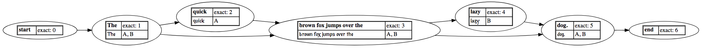

# Running CollateX inside a Docker container

David J. Birnbaum and Ronald Haentjens Dekker  
Last revised 2017-12-29

## Rationale

[CollateX](https://pypi.python.org/pypi/collatex) has a small number of dependencies that cause problems for some users. Distributing CollateX in a [Docker](https://www.docker.com/) container means that the dependences can be packaged with it. Specifically:

* CollateX requires version 1.11 of the [NetworkX](https://pypi.python.org/pypi/networkx) library, but the most recent release, 2.0, uses a different API, which breaks CollateX. By running CollateX inside a Docker container, users who need later versions of NetworkX for other purposes will not have to downgrade their general Python library installation or create a separate Python environment just to run CollateX.
* CollateX uses the [python-Levenshtein](https://pypi.python.org/pypi/python-Levenshtein) package to support near matching. This package is a C library that is built on the local system, and not all users will have installed the compilers the build requires.
* CollateX uses the [PyGraphviz](https://pypi.python.org/pypi/pygraphviz) package to support SVG output of the variant graph. Like python-Levenshtein, PyGraphviz has to be compiled on the local machine. 

## Instructions

### Install Docker

Check the “What to know before you install” section at [Docker for Mac (CE)](https://docs.docker.com/docker-for-mac/install/) or [Docker for Windows (CE)](https://docs.docker.com/docker-for-windows/install/). If you meet these requirements, install the stable channel release of Docker CE. If not, install [Docker toolbox](https://docs.docker.com/toolbox/overview/) instead.

#### For Windows users
Following Docker installation, Windows users are likely to be prompted by Docker to enable Hypercard-V in order to provide the virtualization on which Docker relies. The first time you try to start Docker after a reboot, you may see an error message prompting you to enable hardware-assisted virtualization in your BIOS. First read more about [virtualization and how to check your settings here](https://docs.docker.com/docker-for-windows/troubleshoot/#virtualization-must-be-enabled). Accessing your BIOS depends on which company designed your motherboard (its hardware) and the version of Windows you are running. (For example, on one tester’s computer running Windows 10 Education, the BIOS was designed by the ASUS company to work with an Intel Xeon 2.4 Ghz processor. This information was needed to look up how to enable virtualization on this particular machine. In this case, two settings needed to be changed to “enabled”: Intel Virtualization Tech and IntelVT for Directed I/O.) The specific settings and their location in the BIOS will vary considerably, and you may need to test this a few times in order to get Docker to run.

### Configure a Docker image

Copy (or [download](Dockerfile)) the following text into a file called `Dockerfile` in an otherwise empty directory:

```bash
FROM jupyter/datascience-notebook
USER root
COPY start-notebook.sh '/usr/local/bin'
RUN apt-get -y update && apt-get install -y \
    graphviz \
    libgraphviz-dev \
    graphviz-dev \
    pkg-config \
    tofrodos \
  && rm -rf /var/lib/apt/lists/* \
  && fromdos '/usr/local/bin/start-notebook.sh' \
  && chmod +x '/usr/local/bin/start-notebook.sh'
USER jovyan
RUN pip install --upgrade --pre collatex \
  && pip uninstall -y networkx \
  && pip install -Iv networkx==1.11 \
  && pip install python-levenshtein \
  && pip install pygraphviz
CMD ["start-notebook.sh"]
```

Copy (or [download](start-notebook.sh)) the following text into a file called `start-notebook.sh` in the same directory:

```bash
#!/bin/bash
exec jupyter notebook --NotebookApp.token='' &> /dev/null &
exec bash
```

Note: The user created by the Jupyter base image has userid `jovyan`.

### Create the image

Create an image by executing the following command in that directory (note that the line ends in a space followed by a dot):

```
docker build -t collatex .
```

This may take a long time, but you only have to do it once, and unless you raise an error, you can ignore the messages that will scroll down your screen. If the build process errors out with a “context canceled” message, start it again and it should pick up where it left off. After you’ve completed the build, you can then run the image, when needed, without rebuilding each time.

### Create a workspace

Inside the directory where you are configuring the container, run the following command

```bash
mkdir work
```

Normally information on the local file system is not accessible inside the container, and files written inside the container disappear when the container exits. We create and configure a `work` directory to hold persistent data, that is, pre-existing local files that we want to be accessible inside the container, as well as files created inside the container that we want to remain accessible on the local file system after the container exits.

### Run the image

Run the image by executing the following command:

```
 docker run -it -p 8888:8888 --rm -v '/Users/djb/collatex-docker/work:/home/jovyan/work' collatex
```

Notes:

* *Windows users* must follow the instructions at <https://rominirani.com/docker-on-windows-mounting-host-directories-d96f3f056a2c> in order to mount the local volume inside the container.
* *All users* must change the argument to the `-v` switch so that the part before the colon is a *full* path to a directory that exists on *their* local file systems. In the section above, we created a `work` directory in a specific location for that purpose, but you can mount any local directory instead. The part after the colon doesn’t change; whatever directory you specify will be accessible inside the container at the address `/home/jovyan/work`.
* If you are using port 8888 for another purpose on your host machine, change the number before the colon in the argument to the `-p` switch. For example, to access the notebook at <http://localhost:8889>, use `-p 8889:8888`. Do not change the number after the colon.

The command above does the following:

* Starts a container from your Docker image.
* Deposits you at the command line of a Unix virtual machine, where you will be logged in as userid `jovyan` at `/home/jovyan`. You can then start an interactive Python session and use CollateX as you normally would.
* Starts a Jupyter notebook server inside the container, which you can access from your local machine at <http://localhost:8888>.
* Mounts the local directory `/Users/djb/collatex-docker/work` inside the container as `/home/jovyan/work`. Anything already in that directory when you launch the container will be accessible inside the container, and anything you write into that directory while inside the container will remain accessible on the host machine after the container exits.

## Testing your container

### At the command line

Inside the container, start a Python session and run:

```python
from collatex import *
collation = Collation()
collation.add_plain_witness("A", "The quick brown fox jumps over the dog.")
collation.add_plain_witness("B", "The brown fox jumps over the lazy dog.")
alignment_table = collate(collation)
print(alignment_table)
```

You should see:

```
+---+-----+-------+--------------------------+------+------+
| A | The | quick | brown fox jumps over the | -    | dog. |
| B | The | -     | brown fox jumps over the | lazy | dog. |
+---+-----+-------+--------------------------+------+------+
```

### Inside a Jupyter notebook

Inside a cell, run:

```python
from collatex import *
collation = Collation()
collation.add_plain_witness("A", "The quick brown fox jumps over the dog.")
collation.add_plain_witness("B", "The brown fox jumps over the lazy dog.")
alignment_table = collate(collation)
print(alignment_table)
collate(collation,output="svg")
```

You should see:




## Cleaning up

Building Docker images may create intermediate images or containers (instances of images) that do not remove themselves cleanly when they are no longer needed. These are harmless, but messy, and they do take up disk space. The following commands will help manage them. Note that before you remove an image you need to remove any containers that refer to it.

Command | What it does 
---- | ----
`docker ps -a` | list all containers 
`docker rm <container-id>` | remove the container
`docker images -a` | list all images
`docker rmi <image-id>` | remove the image

## Explanation

1. Documentation for the Jupyter base image is available at <https://hub.docker.com/r/jupyter/datascience-notebook/>.
1. The strategy for starting both a notebook server and an interactive command line simultaneously is partially based on <https://stackoverflow.com/questions/34865097/run-jupyter-notebook-in-the-background-on-docker>.
1. The `docker run` command uses the following arguments (the explanation below is derived from <https://djangostars.com/blog/what-is-docker-and-how-to-use-it-with-python/>):
	* `-t` flag assigns a pseudo-tty or terminal inside the new container.
	* `-i` flag allows you to make an interactive connection by grabbing the standard input (STDIN) of the container.
	* `--rm` flag automatically removes the container when the process exits. By default, containers are not deleted. This container exists as long as the shell session is active, and terminates when we exit from the session.
	* `-v '/Users/djb/collatex-docker/work:/home/jovyan/work'` makes the `/Users/djb/collatex-docker/work` directory accessible inside the container as `/home/jovyan/work`. Before running the command, you must change the part before the colon to the *full* path to an *existing* directory on *your* own local filesystem.
